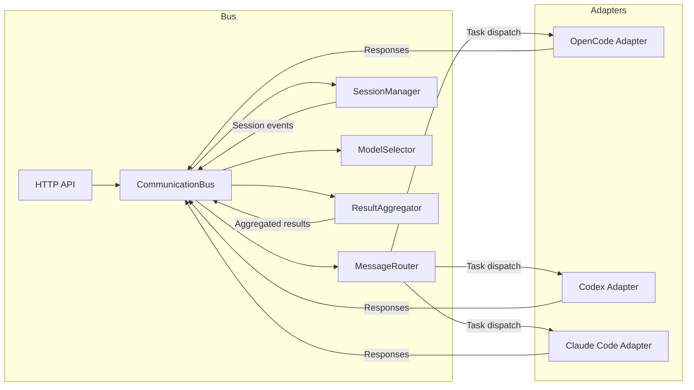

# Architecture Overview

This document summarizes the Agent Communication Bus internals, highlighting core services, adapters, and data flow. Use it as a primer before extending the system or designing new integrations.

## High-Level Components

- **CommunicationBus (`src/communication-bus.ts`)**  
  Express HTTP server + WebSocket server. Handles agent registration, message routing, metrics, and lifecycle hooks.
- **SessionManager (`src/session-manager.ts`)**  
  Tracks multi-agent workflows, task assignments, and shared session context.
- **MessageRouter (`src/message-router.ts`)**  
  Applies routing strategies (direct, capability-based, framework-based) and load balancing.
- **ModelSelector (`src/model-selector.ts`)**  
  Chooses optimal models per task based on cost, latency, and capability metadata.
- **ResultAggregator (`src/result-aggregator.ts`)**  
  Merges responses from multiple agents using consensus or confidence-weighted strategies.
- **Adapters (`src/adapters/*`)**  
  Framework bridges (OpenCode, Codex CLI, Claude Code). All inherit from `BaseAdapter` to share connection logic.

## Data Flow

## Execution Lifecycle
1. **Startup** – `AgentCommunicationFactory` instantiates the bus, starts HTTP/WebSocket servers, and initializes enabled adapters.
2. **Registration** – Adapters register via `POST /agents/register`, establishing WebSocket connections for message delivery.
3. **Task Routing** – Messages posted via REST or adapters trigger routing logic, session updates, and optional model selection recommendations.
4. **Processing** – Adapters translate bus messages into framework-specific CLI/SDK calls, then send results back as `task_response`.
5. **Aggregation & Shutdown** – Result aggregator consolidates multi-agent responses; `system.shutdown()` gracefully closes adapters and the bus.

## Extensibility Points
- **New Adapters** – Extend `BaseAdapter`, implement `handleMessage`, and expose configuration through `config/*.json`.
- **Routing Strategies** – Add new functions in `MessageRouter` or inject custom strategies via configuration once the plugin interface is finalized.
- **Persistence** – Replace in-memory maps with database-backed repositories by wiring persistence services through the bus constructor options.
- **Observability** – Hook into `EventEmitter` events from the bus, router, and session manager to publish metrics or traces.

## Deployment Considerations
- Stateless core; horizontal scaling requires shared persistence (Redis/PostgreSQL) for queues and sessions.
- Health endpoints (`/health`) and metrics (`/metrics`) support container orchestrators.
- Environment-driven configuration via `config/default.json` + `production.json` ensures consistent builds across environments.
