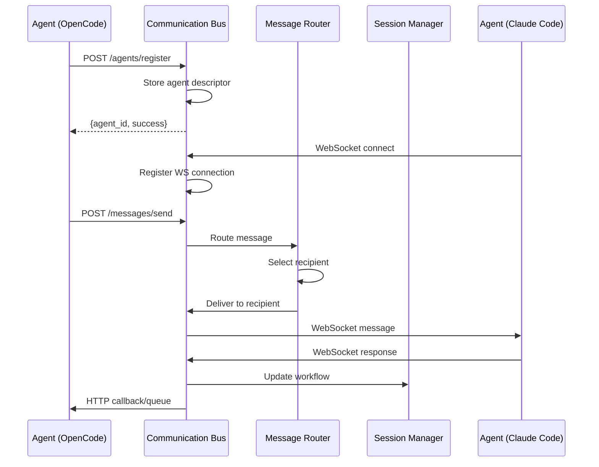
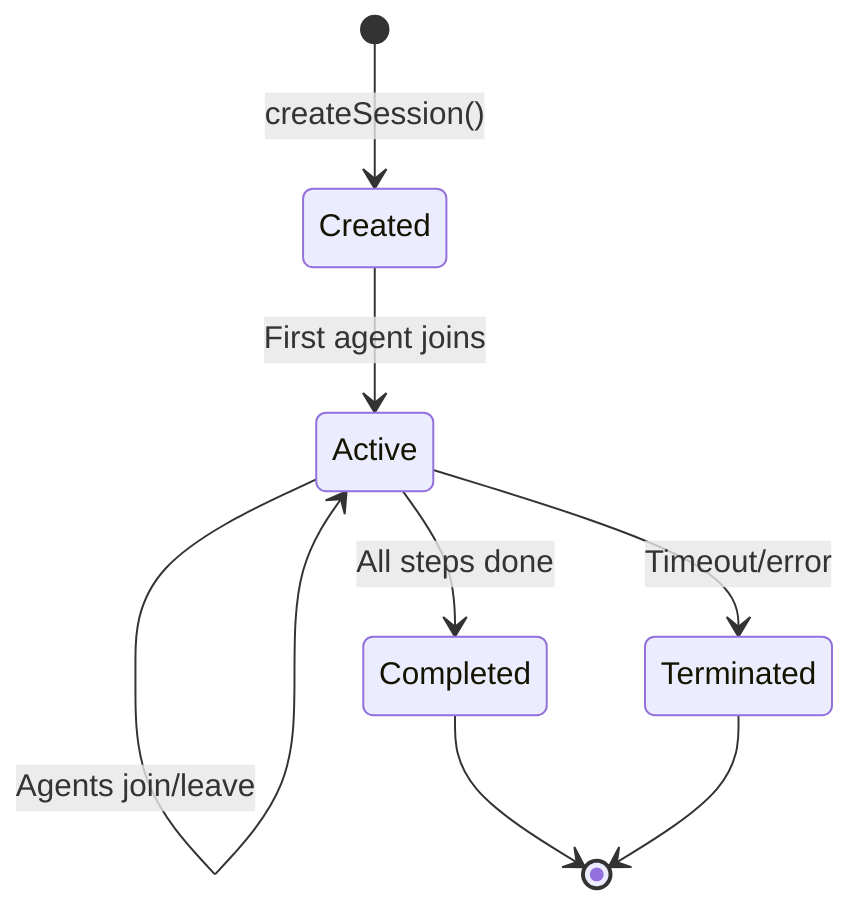
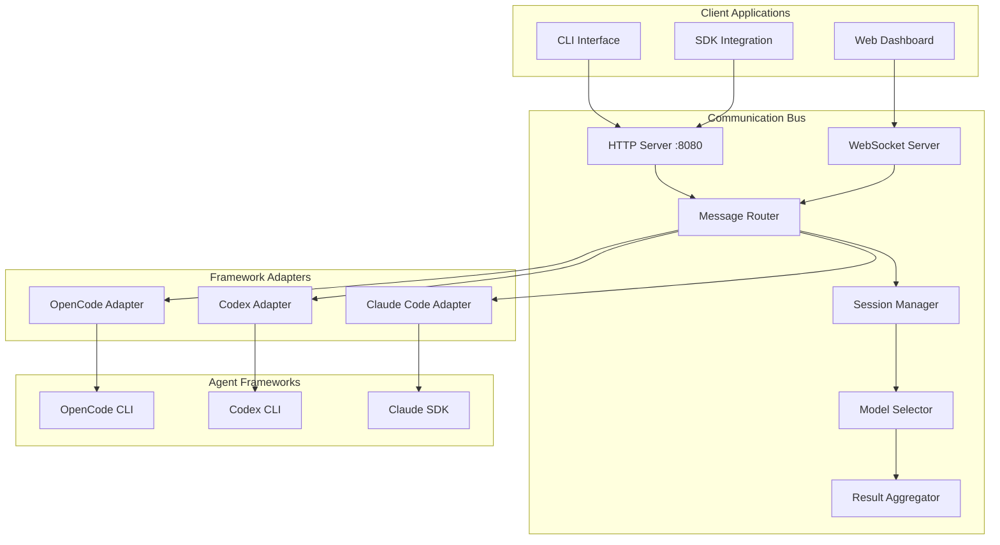
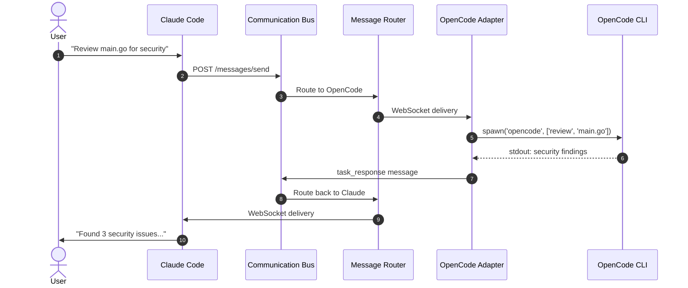

# Architecture Input for Codex Documentation

**Created**: 2025-10-22
**Author**: Claude Code (Architecture Review)
**Purpose**: Provide accurate architectural information for documentation writing

---

## Executive Summary

This document provides Codex with comprehensive architectural details, API specifications, and documentation guidance for the Agent Communication Bus project. Use this as the authoritative source for writing accurate documentation.

---

## 1. System Overview

### What It Actually Is

The Agent Communication Bus is a **centralized message routing system** that enables different AI agent frameworks (OpenCode, Codex CLI, Claude Code) to:

1. Register their capabilities
2. Send/receive structured messages
3. Participate in multi-agent sessions
4. Aggregate results from multiple agents

**Key Insight**: It's NOT just a message queue - it's an intelligent orchestration layer with routing strategies, model selection, and result synthesis.

---

## 2. Core Architecture

### Component Hierarchy

```
AgentCommunicationFactory (Entry Point)
    ├── CommunicationBus (Central Hub)
    │   ├── Express HTTP Server (REST API)
    │   ├── WebSocket Server (Real-time)
    │   ├── MessageRouter (Intelligent routing)
    │   ├── SessionManager (Workflow orchestration)
    │   ├── ModelSelector (Model selection)
    │   └── ResultAggregator (Multi-agent synthesis)
    │
    └── Framework Adapters
        ├── OpenCodeAdapter (CLI process spawning)
        ├── CodexAdapter (CLI process spawning)
        └── ClaudeCodeAdapter (SDK integration)
```

### Data Flow (Critical for Documentation)



---

## 3. REST API Specification

### Base URL
```
http://localhost:8080
```

### Endpoints

#### 1. Agent Registration
```http
POST /agents/register
Content-Type: application/json

Request Body:
{
  "agent": {
    "agent_id": "opencode://golang-pro",
    "framework": "opencode",
    "capabilities": {
      "input_types": ["code", "documentation"],
      "output_types": ["analysis", "generated_code"],
      "languages": ["go", "python"],
      "tools": ["git", "linter"],
      "model_preferences": ["claude-3.5-sonnet"],
      "optimal_tasks": ["code_review", "debugging"],
      "performance_profile": {
        "avg_response_time": "5s",
        "success_rate": 0.95,
        "concurrent_capacity": 3
      }
    },
    "endpoints": {
      "http": "http://localhost:9000",
      "websocket": "ws://localhost:9000"
    },
    "metadata": {
      "version": "1.0.0",
      "author": "OpenCode Team",
      "tags": ["golang", "code-review"],
      "description": "Go language specialist"
    }
  },
  "authentication": {
    "type": "api_key",
    "credentials": "your-api-key"
  }
}

Response: 200 OK
{
  "success": true,
  "agent_id": "opencode://golang-pro"
}

Error Response: 400 Bad Request
{
  "success": false,
  "error": "Invalid agent descriptor"
}
```

#### 2. Agent Unregistration
```http
DELETE /agents/{agentId}

Response: 200 OK
{
  "success": true
}
```

#### 3. Send Message
```http
POST /messages/send
Content-Type: application/json

Request Body:
{
  "message_id": "msg_1234567890",
  "timestamp": "2025-10-22T18:00:00Z",
  "sender": {
    "agent_id": "claude-code://coordinator",
    "framework": "claude-code",
    "session_id": "sess_abc123"
  },
  "recipient": {
    "agent_id": "opencode://golang-pro",
    "framework": "opencode"
  },
  "message_type": "task_request",
  "priority": "high",
  "payload": {
    "task_type": "code_review",
    "files": ["main.go", "utils.go"],
    "requirements": ["security", "performance"]
  },
  "routing": {
    "timeout": "300s",
    "retry_policy": {
      "max_retries": 3,
      "backoff": "exponential"
    },
    "fallback_agents": ["codex://code-reviewer"],
    "delivery_mode": "async"
  },
  "metadata": {
    "user_id": "user123",
    "project": "my-app"
  }
}

Response: 200 OK
{
  "success": true
}
```

#### 4. Get Metrics
```http
GET /metrics

Response: 200 OK
{
  "total_messages": 1523,
  "active_sessions": 12,
  "registered_agents": 8,
  "average_response_time": 3245,
  "error_rate": 0.02,
  "uptime": 864000000,
  "throughput": 45.2
}
```

#### 5. Health Check
```http
GET /health

Response: 200 OK
{
  "status": "healthy",
  "uptime": 864000000
}
```

---

## 4. WebSocket Protocol

### Connection
```
ws://localhost:8080
```

### Message Format (Identical to REST)
```json
{
  "message_id": "msg_1234567890",
  "timestamp": "2025-10-22T18:00:00Z",
  "sender": {...},
  "recipient": {...},
  "message_type": "task_response",
  "priority": "medium",
  "payload": {...},
  "routing": {...}
}
```

### Message Types
1. `task_request` - Request to perform a task
2. `task_response` - Response with task results
3. `status_update` - Progress updates during execution
4. `error` - Error notifications
5. `heartbeat` - Keep-alive messages

### Event Flow
1. **Client connects** → Server acknowledges
2. **Client sends message** → Server routes to recipient
3. **Server forwards** → Recipient WebSocket
4. **Recipient responds** → Server routes back
5. **Connection closed** → Cleanup

---

## 5. Agent URI Format

**Pattern**: `{framework}://{agent-type}`

**Examples**:
- `opencode://golang-pro`
- `codex://frontend-developer`
- `claude-code://task-coordinator`

**Rules**:
- Framework must match registered framework
- Agent-type is free-form but should be descriptive
- URI is unique identifier across system

---

## 6. Session Management

### Session Lifecycle



### Session Context Structure
```typescript
{
  "sessionId": "sess_abc123",
  "orchestrator": "claude-code://coordinator",
  "participants": [
    {
      "agent_id": "opencode://golang-pro",
      "framework": "opencode",
      "role": "implementer",
      "status": "active",
      "join_time": "2025-10-22T18:00:00Z"
    }
  ],
  "workflow": {
    "current_step": "code_review",
    "completed_steps": ["design", "implementation"],
    "pending_steps": ["testing", "deployment"],
    "steps": [...]
  },
  "shared_context": {
    "project_name": "my-app",
    "branch": "feature/new-feature"
  },
  "created_at": "2025-10-22T17:00:00Z",
  "updated_at": "2025-10-22T18:00:00Z"
}
```

---

## 7. Result Aggregation

### Synthesis Methods

1. **Consensus** - Majority vote across agents
2. **Specialist Priority** - Weight by agent expertise
3. **Confidence Weighted** - Weight by reported confidence
4. **Manual** - Requires human review

### Conflict Types
- `result_disagreement` - Different answers
- `approach_difference` - Different methodologies
- `priority_conflict` - Competing priorities

---

## 8. Configuration Files

### config/default.json (Development)
```json
{
  "bus": {
    "host": "localhost",
    "port": 8080,
    "corsOrigins": ["*"],
    "maxConnections": 100
  },
  "session": {
    "defaultTimeout": 3600000,
    "maxParticipants": 10,
    "persistenceEnabled": false
  },
  "routing": {
    "defaultStrategy": "round_robin",
    "loadBalancing": true
  }
}
```

### config/production.json
```json
{
  "bus": {
    "host": "0.0.0.0",
    "port": 8080,
    "corsOrigins": ["https://app.example.com"],
    "maxConnections": 1000
  },
  "session": {
    "defaultTimeout": 7200000,
    "maxParticipants": 50,
    "persistenceEnabled": true
  },
  "routing": {
    "defaultStrategy": "least_loaded",
    "loadBalancing": true
  }
}
```

### .env.example
```bash
# Communication Bus
AGENT_BUS_HOST=localhost
AGENT_BUS_PORT=8080
AGENT_BUS_API_KEY=your-api-key-here

# OpenCode Integration
OPENCODE_BINARY_PATH=/usr/local/bin/opencode
OPENCODE_WORKING_DIR=/path/to/workspace

# Codex CLI Integration
CODEX_CLI_PATH=/usr/local/bin/codex
CODEX_API_KEY=your-codex-key

# Claude Code Integration
ANTHROPIC_API_KEY=your-anthropic-key
CLAUDE_WORKSPACE_PATH=/path/to/workspace

# Database (Future)
DB_HOST=localhost
DB_PORT=5432
DB_NAME=agent_bus
DB_USER=postgres
DB_PASSWORD=your-password

# Redis Cache (Future)
REDIS_HOST=localhost
REDIS_PORT=6379
REDIS_PASSWORD=your-redis-password

# Logging
LOG_LEVEL=info
LOG_FORMAT=json
```

---

## 9. Documentation Priorities (Corrected)

### CRITICAL (Do These First)

1. **API Reference** (`docs/api/`)
   - HTTP endpoints with full examples (use Section 3 above)
   - WebSocket protocol (use Section 4 above)
   - Message format specification (use protocol.ts types)
   - Error codes and handling

2. **Quickstart Guide** (`docs/quickstart.md`)
   - Installation steps
   - Basic usage example (using AgentCommunicationFactory.quickStart())
   - First agent registration
   - First message send/receive

3. **Integration Guides** (`docs/integrations/`)
   - OpenCode: How to spawn processes, capture output
   - Codex: How to integrate CLI, handle responses
   - Claude Code: How to use SDK, natural language interface (future)

### HIGH PRIORITY

4. **Architecture Documentation** (`docs/architecture.md`)
   - Component diagram (use Section 2 mermaid)
   - Data flow diagrams
   - Design decisions and rationale

5. **Developer Guide** (`docs/development/`)
   - CONTRIBUTING.md - PR process, code style
   - Setup guide - environment, dependencies
   - Testing guide - how to write tests

### MEDIUM PRIORITY

6. **Tutorials** (`docs/tutorials/`)
   - Multi-agent collaboration example
   - Custom adapter creation
   - Session management walkthrough

7. **Troubleshooting** (`docs/troubleshooting.md`)
   - Common issues and solutions
   - Debug strategies
   - FAQ

---

## 10. Key Corrections to Codex Task List

### ❌ Incorrect Assumptions

1. **Docker Setup** - Already partially done by OpenCode
   - ✅ Dockerfile exists
   - ✅ docker-compose.yml exists
   - ⏳ Need docker-compose.prod.yml enhancements
   - ⏳ Need documentation

2. **Environment Configuration** - Already complete
   - ✅ .env.example exists
   - ✅ config files exist
   - ✅ Validation script exists

### ✅ What Still Needs Doing

1. **CI/CD Pipeline** - Not started
2. **API Documentation** - Critical, not started
3. **Integration Guides** - Critical, not started
4. **Architecture Diagrams** - Use mermaid (Section 2)
5. **Example Projects** - Not started
6. **ESLint config** - Missing (.eslintrc.js doesn't exist yet)

---

## 11. Example Code Snippets for Docs

### Basic Usage
```typescript
import { AgentCommunicationFactory } from '@vibes/agent-communication-bus';

// Quick start with defaults
const system = await AgentCommunicationFactory.quickStart();

// System is now running with bus on port 8080
// OpenCode, Codex, and Claude Code adapters initialized

// Shutdown when done
await system.shutdown();
```

### Custom Configuration
```typescript
import { CommunicationBus, OpenCodeAdapter } from '@vibes/agent-communication-bus';

// Create custom bus
const bus = new CommunicationBus({
  host: 'localhost',
  port: 9000,
  corsOrigins: ['https://myapp.com'],
  persistenceEnabled: true
});

await bus.start();

// Create custom adapter
const adapter = new OpenCodeAdapter(
  'opencode://custom-agent',
  'http://localhost:9000',
  {
    binaryPath: '/usr/local/bin/opencode',
    workingDir: '/my/workspace'
  }
);

await adapter.initialize();
```

---

## 12. Mermaid Diagrams for Documentation

### System Architecture


### Message Flow


---

## 13. Writing Guidelines for Codex

### Tone and Style
- **Be concise** - Developers skim, don't read deeply
- **Show code first** - Examples before explanations
- **Be accurate** - Use actual type names from protocol.ts
- **Be complete** - Include all parameters, not just common ones

### Structure Template
```markdown
# Feature Name

## Overview
One paragraph explaining what it does.

## Quick Example
\`\`\`typescript
// Minimal working code
\`\`\`

## API Reference
Detailed parameters and return values.

## Advanced Usage
Edge cases and options.

## Troubleshooting
Common errors and solutions.
```

### Code Example Standards
```typescript
// ✅ GOOD - Complete, runnable
import { CommunicationBus } from '@vibes/agent-communication-bus';

const bus = new CommunicationBus({ port: 8080 });
await bus.start();

// ❌ BAD - Incomplete, missing imports
const bus = new CommunicationBus(...);
```

---

## 14. Testing Documentation Requirements

When documenting testing:

1. **Show actual test structure** (from tests/unit/)
2. **Explain mock usage** (from tests/utils/)
3. **Document test fixtures** (from tests/fixtures/)
4. **Include coverage expectations** (80%+ for core)

Example:
```typescript
import { CommunicationBus } from '../src/communication-bus';
import { MockDataGenerator } from './utils/test-helpers';

describe('CommunicationBus', () => {
  it('should register agent successfully', async () => {
    const bus = new CommunicationBus({ port: 8080 });
    const agent = MockDataGenerator.createAgentDescriptor();

    await bus.start();
    const agentId = await bus.registerAgent({ agent });

    expect(agentId).toBe(agent.agent_id);
    await bus.stop();
  });
});
```

---

## 15. Action Items for Codex

### Week 1 Priorities (In Order)

1. **API Documentation** (`docs/api/`)
   - Start with `http-endpoints.md` (use Section 3)
   - Then `websocket-protocol.md` (use Section 4)
   - Then `message-format.md` (use protocol.ts + examples)

2. **Quickstart** (`docs/quickstart.md`)
   - Installation
   - Basic example (use Section 11)
   - Next steps

3. **Architecture** (`docs/architecture.md`)
   - System overview (use Section 2)
   - Component descriptions
   - Data flow (use mermaid diagrams)

### Week 2 Priorities

4. **Integration Guides** (`docs/integrations/`)
   - Start with `opencode.md` (most complete adapter)
   - Then `claude-code.md` (for coordination)
   - Then `codex.md`

5. **Developer Guide** (`docs/development/`)
   - CONTRIBUTING.md
   - Setup and environment
   - Testing guide

### Week 3

6. **Tutorials and Examples**
7. **Troubleshooting**
8. **CI/CD Setup**

---

## 16. Quality Checklist for Documentation

Before marking documentation as complete:

- [ ] All code examples tested and work
- [ ] All type names match protocol.ts exactly
- [ ] All endpoint URLs match communication-bus.ts
- [ ] Mermaid diagrams render correctly in GitHub
- [ ] No broken internal links
- [ ] README has been reviewed for accuracy
- [ ] Examples use realistic data (not placeholders)

---

## 17. Questions Codex Should Ask

If uncertain about any of these, ask Claude Code:

1. **Natural Language Interface** - How will it work? (Not yet implemented)
2. **Authentication** - Current security model? (Basic, needs enhancement)
3. **Database Persistence** - When/how implemented? (Future feature)
4. **Rate Limiting** - Is it implemented? (No, document as future)
5. **MCP Protocol** - How does it integrate? (Not yet, future)

---

## Final Notes

- **This document is authoritative** - Use it as source of truth
- **Code is accurate** - TypeScript files match this spec
- **Be pragmatic** - Document what exists, flag what's planned
- **Update this doc** - If you find inaccuracies, flag them

**Good luck! Your documentation will help many developers understand and use this system effectively.**

---

**Claude Code is available for questions and clarifications.**
